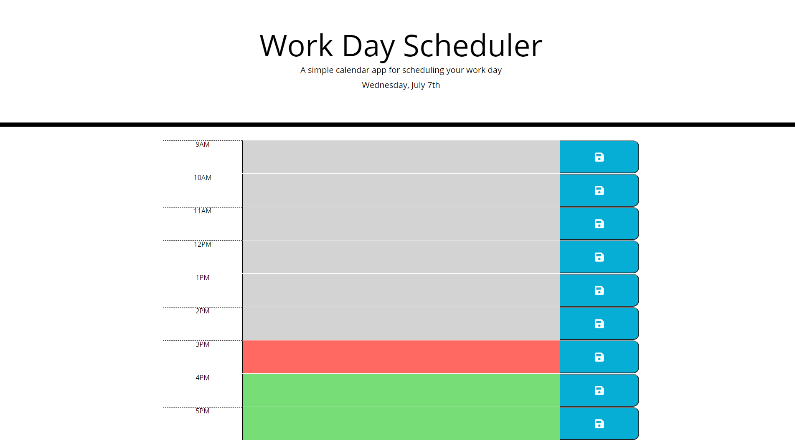

# Work-Day-Scheduler

## Description

A simple calendar app that allows you to record important tasks for your work day!

In this project I have used bootstrap to style the page, Javascript to dynamically generate the content (including using localStorage to have saved data persist between page refreshes) and MomentJS to get the current time.

## Usage

Add important tasks for each hour of your work day by entering the details into the textboxes. Click the save button to save that particular task, saved tasks will persist between page loads (NOTE: this uses localStorage so will not persist between browsers or computers or if the localStorage is cleared).

Each time block will be highlighted in the following fashion: 
- Grey for times in the past
- Red for times in the present
- Green for times in the future

The completed website can be viewed at: https://rileylum.github.io/Work-Day-Scheduler/

## Credits

I used bootstrap for the styling which can be found at: https://getbootstrap.com/

I used MomentJS for interacting with time which can be found at: https://momentjs.com/

I didn't use jquery in this app instead opting to use vanilla JS to dynamically generate the page, for which i referenced the MDN documentation for the document object: https://developer.mozilla.org/en-US/docs/Web/API/Document
